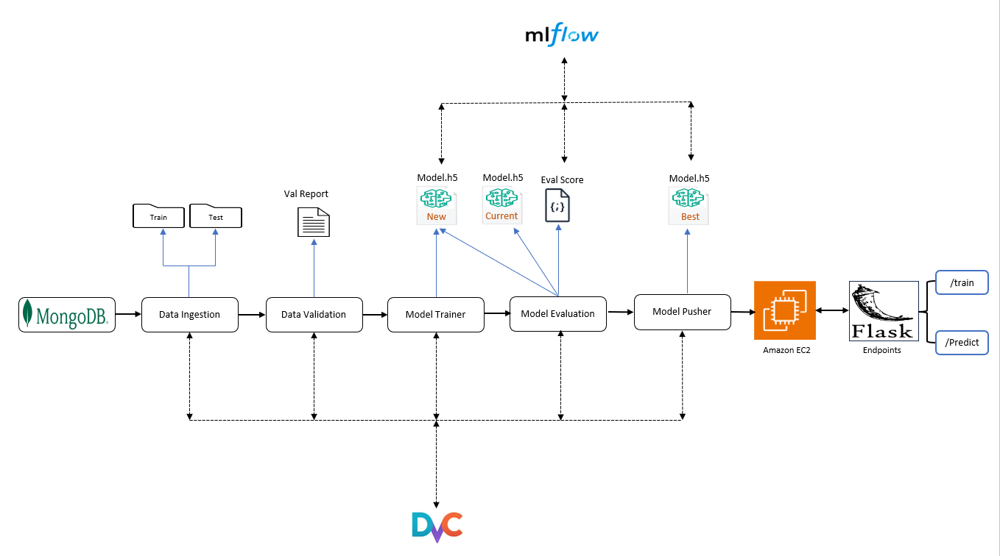

# Alzheimer’s Disease Detection : 
* Alzheimer's disease is a progressive and irreversible neurodegenerative disorder that causes memory loss, cognitive impairment, and a decline in various brain functions, leading to a loss of independence in daily life. It is estimated that the number of people affected by Alzheimer's disease will increase from 47 million to 152 million by 2050, resulting in significant economic, medical, and societal consequences. There is currently no cure or treatment available that can halt the disease progression, and its pathophysiology remains unknown. Patients with amnestic moderate cognitive impairment (MCI) are at a higher risk of developing Alzheimer's disease, emphasizing the importance of early detection through MCI screening to facilitate better care and the development of new treatments.

# Objective
* The main objective of this project is to detect Alzheimer's disease  early using a CNN network approach and Transfer Learning . The project aims to analyze brain MRI data and develop a CNN model that can differentiate between different cognitive states, including 'MildDemented', 'ModerateDemented', 'NonDemented', and 'VeryMildDemented'. By leveraging this CNN model, we aim to enhance early detection and contribute to improved diagnoses and interventions for individuals at risk of Alzheimer's disease.


<div style="display:flex; justify-content: space-between; align-items: flex-start;">
    <div style="flex-basis: 49%;">
        <h3>Project Architecture</h3>
        
    </div>
    <div style="flex-basis: 49%;">
        <h3>Deployment Architecture</h3>
        
    </div>
</div>


## Demo Video

[](https://www.youtube-nocookie.com/embed/VzRCK9JzmP8)


## Tech Stack

- Python
- TensorFlow (Machine learning framework for building neural networks)
- NumPy (Numerical computing library)
- Matplotlib (Data visualization library)
- Flask (Python web framework for building web applications)
- Flask-Cors (Extension for handling Cross-Origin Resource Sharing in Flask)
- MongoDB (NoSQL database used for storing data)
- DVC (Data Version Control for managing data pipelines and experiments)
- MLflow (Open-source platform for managing the machine learning lifecycle)
- Docker (Containerization platform for packaging applications and dependencies)


## Infrastructure Required

- AWS EC2: Scalable virtual servers for hosting and running the application
- AWS ECR: Container registry for storing Docker images
- Git Actions: Continuous integration and delivery automation tool


## How to Run?

Before running the project, please ensure that you have the following prerequisites:

1. **MongoDB**: Make sure you have MongoDB installed on your local system, along with MongoDB Compass for data storage. You can download MongoDB from the official website and follow the installation instructions.

2. **AWS Account**: You will need an AWS account to access services like  AWS ECR, and AWS EC2 instances. If you don't have an AWS account, you can create one on the AWS website.

Once you have the prerequisites set up, follow these steps to run the project:
## step 1: Clone repository
1. Clone the repository to your local machine using the following command:

```bash
   git clone https://github.com/Gaurang140/Alzheimer-s-Disease-Detection.git

```
## step 2: Create a enviroment
```bash	
conda create -n alzenv python=3.8 -y
conda activate alzenv
'''

## step 3: Install required dependencies

```bash	
pip install -r requirements.txt
```

## step 4: Set environment variables

```bash	

set MONGODB_URL="mongodb+srv://<username>:<password>@cluster0.ogtv1f4.mongodb.net/?retryWrites=true&w=majority"

```

## step 5: Run the application 

```bash	
python app.py
```
## step 6: to Train 

```bash		
http://localhost:8080/train

```


# Experiment Tracking with MLflow


### ML flow locally 
To run MLflow locally, open a new command prompt or terminal window and execute the following command:

```bash 
mlflow ui
```
This will start the MLflow server locally, and you can access the MLflow UI by visiting http://localhost:5000 in your web browser.


### ML flow remote(Dagshub)
To track experiments externally using Dagshub, set the following environment variables:

```bash 
set MLFLOW_TRACKING_URI=https://dagshub.com/username/Alzheimer-s-Disease-Detection.mlflow 
set MLFLOW_TRACKING_USERNAME= username 
set MLFLOW_TRACKING_PASSWORD= password 

```

Replace <username> and <password> with your Dagshub credentials. This will configure MLflow to use Dagshub as the external tracking server.

# DVC


**Initialize DVC**: Run the following command to initialize DVC:

```bash
   dvc init
```
This will set up DVC and create the necessary configuration files.


**Reproduce the DVC Pipeline**: Execute the following command to reproduce the DVC pipeline and ensure all the dependencies and data are in place:
```bash	
dvc repro
```
This command will run the defined pipeline steps and fetch the required data.

**Visualize the DVC Pipeline Graph**: To get a visual representation of the DVC pipeline, use the following command:

```bash	
dvc dag 
```
This will display a graph that shows the dependencies and relationships between the stages of the pipeline.
